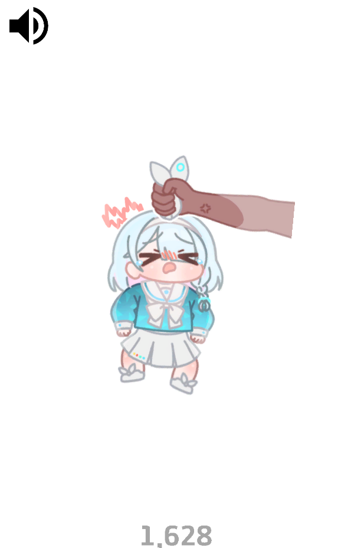

# Arona Shaker

### [🎮 웹에서 플레이](https://aronashaker.netlify.app/)

### 다운로드
- [윈도우(Windows)](https://github.com/hyeon-in/Arona-Shaker/releases/download/v1.0.0/Arona.Shaker.Windows.zip)
- [안드로이드(Android)](https://github.com/hyeon-in/Arona-Shaker/releases/download/v1.0.0/Arona.Shaker.apk)

---

## 소개

**Arona Shaker**는 모바일 게임 "**Blue Archive**"의 비공식 팬게임입니다. 이 게임은 블루 아카이브의 마스코트 캐릭터인 아로나를 붙잡고 흔드는 [Hor님의 그림](https://x.com/horuhara/status/1801806881431884215/)에서 영감을 받아 개발되었습니다. 게임의 목적은 없으며, 아로나를 흔들어 청휘석과 3성 봉투를 뽑아내는 간단한 게임입니다.

### 조작법:
- 마우스 움직이기 / 터치 스와이프

## 개발 세부사항
- **게임 엔진:** Unity (6000.0.37f1)
- **개발 언어:** C#
- **개발 기간:** 2025년 1월 12일 ~ 2025년 1월 13일
- **역할:** 2인 개발
  - Hyeonin: Programmer  
  - HoR: Artist  

## 크레딧

### 원작자
- [Hor(호르)](https://x.com/horuhara)

### 개발
- [Hyeonin(현인)](https://linktr.ee/hyeonin)

### 원작 게임: 블루 아카이브(Blue Archive)
- **개발사: 넥슨게임즈(Nexon Games)**
  - [웹사이트](https://www.nexongames.co.kr/)
- **관련 사이트:**
  - [웹사이트](https://bluearchive.nexon.com/home)
  - [유튜브](https://www.youtube.com/channel/UCsrnDYrkovQhCCE8kwKcvKQ)
  - [X(트위터)](https://x.com/EN_BlueArchive)
- **다운로드:**
  - [Google Play Store](https://play.google.com/store/apps/details?id=com.nexon.bluearchive)
  - [App Store](https://apps.apple.com/kr/app/%EB%B8%94%EB%A3%A8-%EC%95%84%EC%B9%B4%EC%9D%B4%EB%B8%8C/id1571873795)
  - [ONEstroe](https://m.onestore.co.kr/ko-kr/apps/appsDetail.omp?prodId=0000758646)
  - [Galaxy Store](https://galaxystore.samsung.com/detail/com.nexon.bluearchivegalaxy)

### 효과음

효과음은 [Universal Sound FX](https://imphenzia.com/universal-sound-fx)를 Unity Asset Store에서 구매하여 사용하였습니다. 해당 효과음은 타인에게 제공되는 것이 금지되어 있으므로, Asset 파일에 포함되지 않았습니다.

### 폰트
- [경기천년체](https://www.gg.go.kr/contents/contents.do?ciIdx=679&menuId=2457)

## 참고
1. **본 게임은 넥슨게임즈사의 모바일 게임 '블루 아카이브'와는 전혀 관계가 없는 비공식 팬게임입니다.**
2. **본 게임은 넥슨게임즈사의 지적 재산권을 존중하며 상업적 목적이 없습니다.**
3. **게임에 포함된 이미지가 블루 아카이브의 저작물을 포함하고 있으므로, 이 레포지토리에 포함되지 않았습니다.**
4. **본 프로젝트에 포함된 스크립트는 라이선스 제한 없이 자유롭게 사용할 수 있습니다.**
